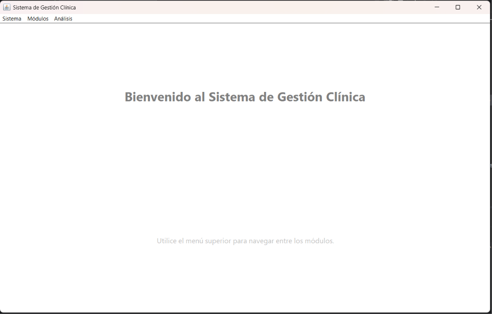
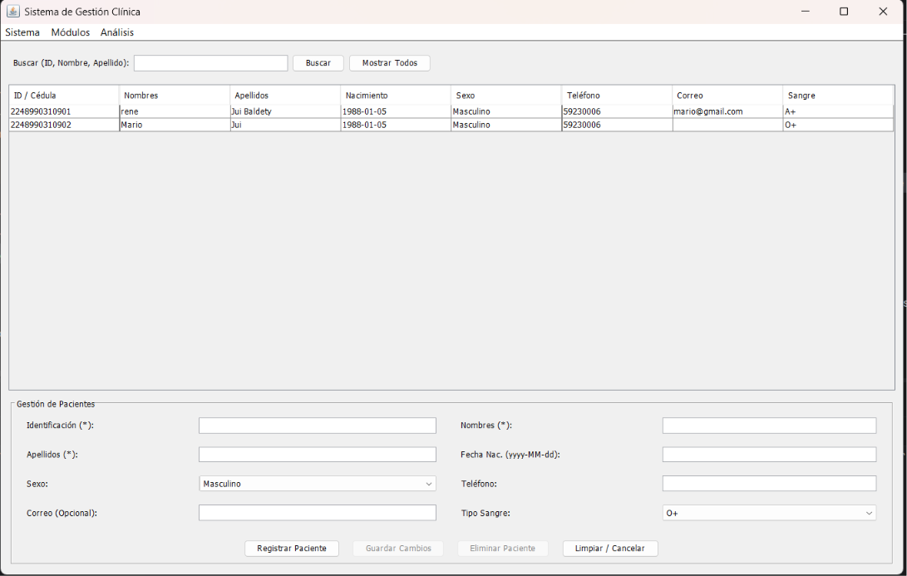
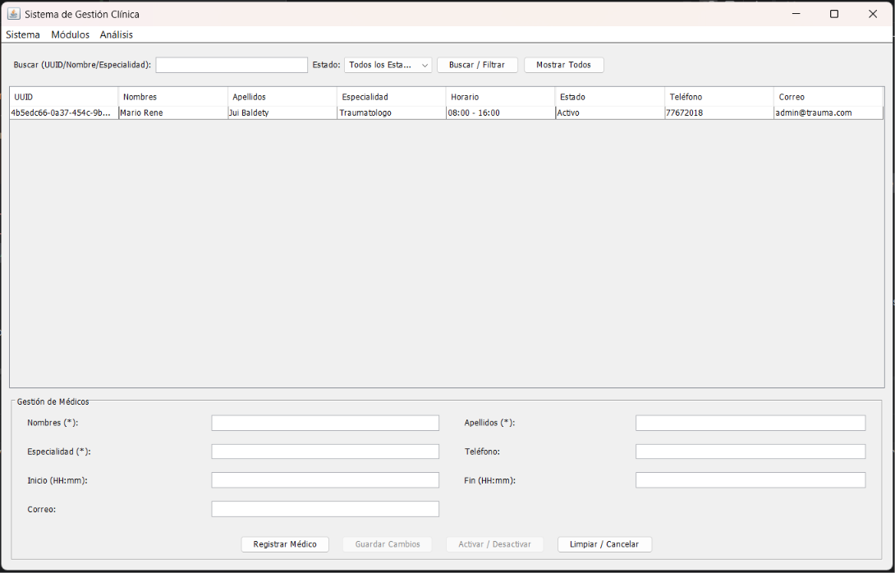
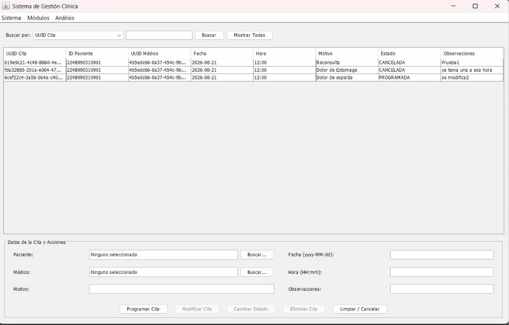
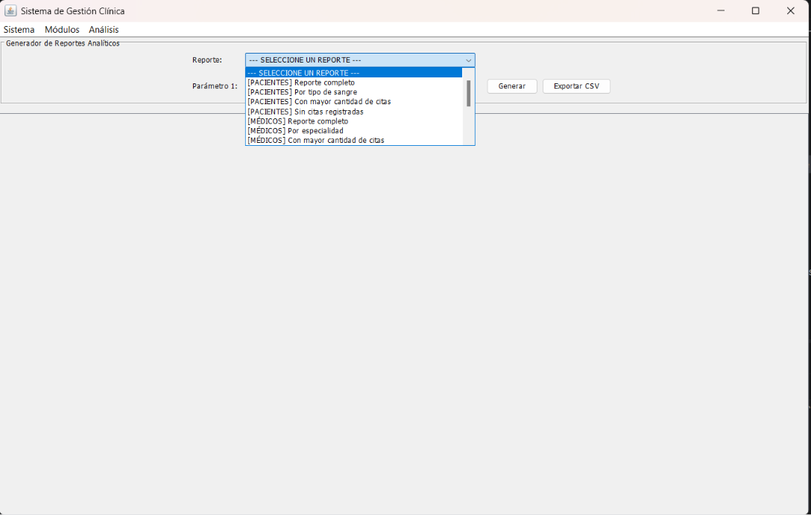

# Manual de Usuario - Sistema de Gestión Clínica

## 1. Introducción
Bienvenido al **Sistema de Gestión Clínica**. Esta aplicación de escritorio está diseñada para optimizar las operaciones diarias de una clínica médica, permitiendo la administración eficiente de pacientes, profesionales de la salud, programación de citas y la extracción de reportes analíticos mediante un entorno visual intuitivo.

---

## 2. Pantalla Principal y Navegación
Al iniciar el sistema, se visualizará la ventana principal (`MainFrame`), la cual cuenta con una barra de menús superior estructurada en tres secciones principales:

* **Sistema:** Permite retornar a la pantalla de bienvenida o salir de la aplicación de forma segura.
* **Módulos:** Contiene los accesos directos para alternar entre las vistas de **Pacientes**, **Médicos** y **Citas y Agendas**.
* **Análisis:** Otorga acceso directo al **Generador de Reportes Analíticos**.

---

## 3. Módulo de Pacientes
Permite mantener al día el padrón de pacientes de la clínica.

* **Registrar Paciente:** Ingrese la información solicitada en el formulario inferior (Identificación, Nombres, Apellidos, Fecha de Nacimiento, Sexo, Teléfono, Correo y Tipo de Sangre). Haga clic en **"Registrar Paciente"**. El sistema validará que la identificación no se encuentre duplicada previamente.
* **Buscar / Filtrar:** Escriba en la barra de búsqueda superior cualquier criterio (ID, nombres o apellidos) y presione **"Buscar"** para filtrar los registros en tiempo real.
* **Modificar Datos:** Seleccione un paciente de la tabla haciendo clic sobre él. Sus datos se cargarán en el formulario y podrá editar los campos permitidos. Haga clic en **"Guardar Cambios"**.
* **Eliminar Paciente:** Seleccione el registro en la tabla y presione **"Eliminar Paciente"**. El sistema aplicará un borrado lógico seguro, conservando la integridad del historial.
* **Acceso Rápido (Menú Contextual):** Haga clic derecho sobre cualquier fila de la tabla para desplegar la opción de copiar el ID del paciente al portapapeles.

---

## 4. Módulo de Médicos
Facilita la administración de la planta de profesionales de la salud y sus horarios de atención.

* **Registrar Médico:** Complete el formulario con los datos del profesional (Nombres, Apellidos, Especialidad, Teléfono, Correo y el Horario de Inicio y Fin en formato `HH:mm`). Haga clic en **"Registrar Médico"**. El sistema generará un identificador único (UUID) de manera automática.
* **Filtrar por Estado:** Utilice el menú desplegable de estados para alternar entre la visualización de "Todos los Estados", "Solo Activos" o "Solo Inactivos".
* **Activar / Desactivar:** Seleccione un médico de la tabla y haga clic en **"Activar / Desactivar"** para cambiar su estado operativo sin alterar su información personal.
* **Modificar Médico:** Seleccione el registro, edite los campos correspondientes en el formulario (respetando los bloques de citas existentes) y haga clic en **"Guardar Cambios"**.

---

## 5. Módulo de Citas y Agendas
Centro neurálgico para la programación y control de la atención médica.

* **Programar Cita:**
    1. Haga clic en el botón **"Buscar..."** junto al campo de Paciente para seleccionarlo desde un diálogo auxiliar.
    2. Haga clic en el botón **"Buscar..."** junto al campo de Médico para elegir al especialista.
    3. Ingrese la **Fecha** (`yyyy-MM-dd`) y la **Hora** (`HH:mm`).
    4. Agregue el **Motivo** de la consulta y las **Observaciones** opcionales.
    5. Presione **"Programar Cita"**. El sistema validará de forma automática que no existan conflictos ni cruces de horarios con la agenda del médico.
* **Modificar Cita:** Al seleccionar una cita existente de la tabla, los campos inmutables (como fecha, hora, paciente y médico) se bloquearán visualmente por seguridad. Podrá actualizar de forma exclusiva el **Motivo** o las **Observaciones** y hacer clic en **"Modificar Cita"**.
* **Cambiar Estado:** Seleccione una cita y presione **"Cambiar Estado"** para transicionar su estado operativo entre `PROGRAMADA`, `ATENDIDA` o `CANCELADA`.
* **Cancelar / Eliminar Cita:** Seleccione la cita a retirar de la agenda activa y haga clic en **"Eliminar Cita"**.

---

## 6. Módulo de Reportes y Análisis
Herramienta analítica para la extracción de información y trazabilidad del sistema.

* **Generar Reporte:**
    1. Despliegue el menú selector de reportes y elija la vista analítica deseada (por ejemplo: reporte de pacientes por tipo de sangre, médicos por especialidad, citas por rango de fechas o el historial completo de auditoría).
    2. Si el reporte seleccionado requiere filtros específicos (como fechas, identificadores o estados), los campos de parámetros se habilitarán automáticamente.
    3. Ingrese los valores requeridos y haga clic en **"Generar"**. Los resultados se proyectarán de manera tabulada en pantalla.
* **Exportar a CSV:** Una vez generado y visualizado cualquier reporte en la tabla, haga clic en el botón **"Exportar CSV"**. Se abrirá un explorador de archivos del sistema operativo para que elija la ruta de destino y guarde la información en un formato plano delimitado por comas, ideal para análisis externos.

