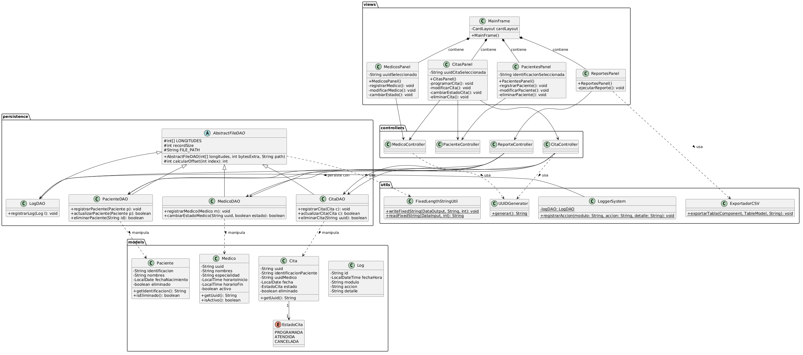
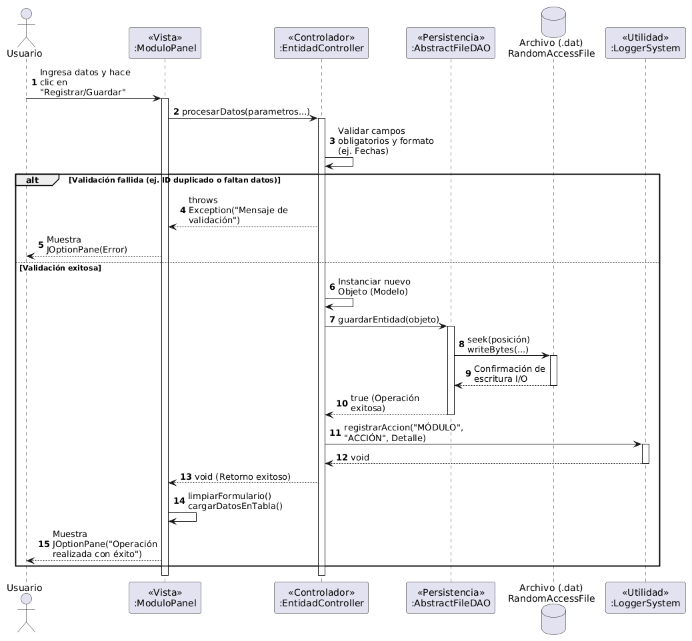
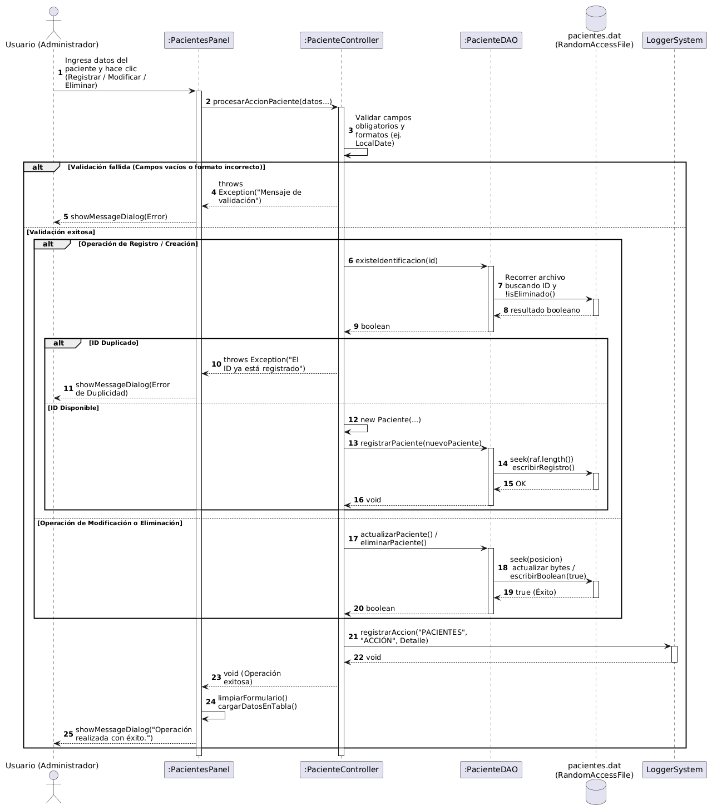
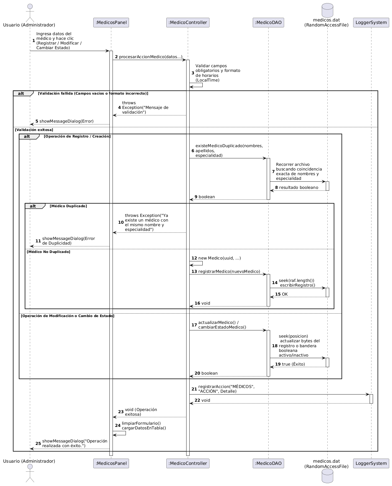
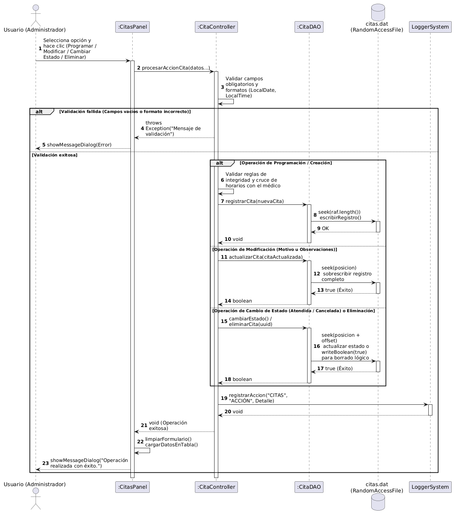
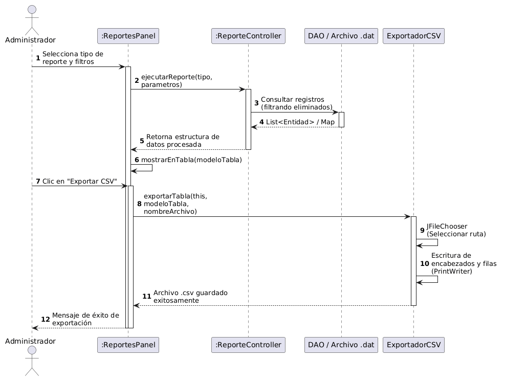
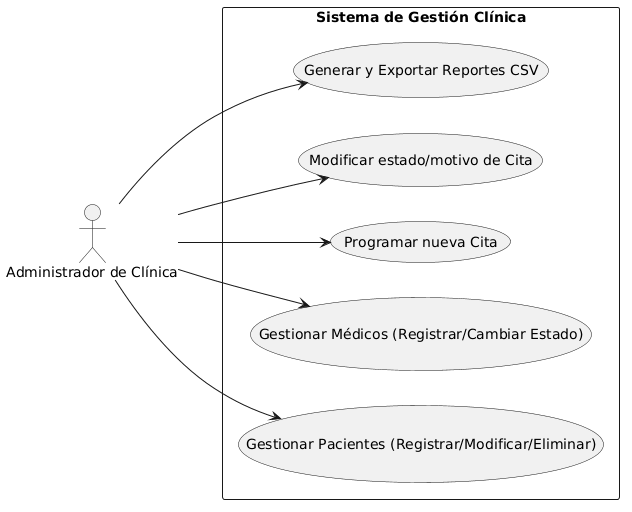

# Documentación Técnica - Sistema de Gestión Clínica

## 1. Descripción General del Proyecto
El **Sistema de Gestión Clínica** es una aplicación de escritorio desarrollada en Java utilizando la arquitectura **Modelo-Vista-Controlador (MVC)** y persistencia personalizada basada en **archivos binarios de acceso aleatorio (`RandomAccessFile`)**, cumpliendo estrictamente con la restricción de no utilizar bases de datos relacionales ni librerías externas de persistencia.

---

## 2. Arquitectura y Componentes Técnicos

### 2.1 Requisitos de Entorno y Versiones
Para compilar, ejecutar y evaluar correctamente el sistema, se requiere el siguiente entorno de desarrollo:
* **Lenguaje de Programación:** Java Development Kit (JDK) **Versión 21**.
* **Gestor de Dependencias / Compilación:** Apache Maven (recomendado para la resolución automática de la estructura del proyecto y empaquetado del archivo JAR).
* **Sistema Operativo:** Independiente (multiplataforma: compatible con Windows, Linux y macOS mediante la máquina virtual de Java).

---

### 2.2 Dependencias del Proyecto
El diseño del software se fundamenta en el uso exclusivo de las **APIs nativas estándar de Java**, cumpliendo con la restricción de no emplear frameworks de persistencia externos (como Hibernate o JPA) ni motores de bases de datos relacionales SQL.

Las librerías y módulos nativos de Java utilizados son:
* **Java Swing (`javax.swing`, `java.awt`):** Utilizado para el diseño y renderizado de la interfaz gráfica de usuario (GUI), componentes tabulares (`JTable`, `DefaultTableModel`), gestores de diseño (`CardLayout`, `GridBagLayout`) y menús contextuales.
* **Java IO (`java.io.RandomAccessFile`, `DataOutput`, `DataInput`):** Base fundamental para la persistencia física personalizada basada en archivos binarios de acceso aleatorio y registros de longitud fija.
* **Java Time (`java.time.LocalDate`, `java.time.LocalTime`, `java.time.LocalDateTime`, `java.time.format.DateTimeFormatter`):** Gestión estricta de fechas, horas, marcas temporales transaccionales y parseo de formatos (`yyyy-MM-dd`, `HH:mm`).
* **Java Utilities (`java.util.*`):** Estructuras de datos avanzadas como `ArrayList`, `HashMap`, `HashSet`, `TreeSet` y flujos funcionales (`Streams`) para el filtrado y procesamiento en memoria RAM.

---

### 2.3 Instrucciones de Compilación y Ejecución (Maven)

El proyecto se encuentra configurado como un proyecto Maven estándar, puedes compilarlo y ejecutarlo desde la terminal mediante los siguientes comandos:

#### 2.3.1 Limpiar y Compilar el Proyecto
Para generar los archivos binarios compilados (`.class`) y empaquetar el código fuente:
```bash
mvn clean compile
```
#### 2.3.2. Generar el Empaquetado Ejecutable (JAR)
Para construir el archivo ejecutable con todas las clases de la aplicación:
```bash
mvn package
```
#### 2.3.3. Ejecución de la Aplicación
Una vez compilado el proyecto, puedes ejecutar la clase principal Main directamente desde la terminal o tu entorno de desarrollo integrado (como IntelliJ IDEA):
```bash
java -jar ClinicaMedica-1.0-SNAPSHOT-jar-with-dependencies.jar
```
### 2.4 Patrón de Capas
* **Capa de Modelo (`models`):** Contiene las clases de dominio que representan las entidades del negocio (`Paciente`, `Medico`, `Cita`, `Log`) y las enumeraciones asociadas (`EstadoCita`).
* **Capa de Persistencia (`persistence`):** Implementa una clase abstracta base (`AbstractFileDAO`) y DAOs especializados (`PacienteDAO`, `MedicoDAO`, `CitaDAO`, `LogDAO`) que gestionan la lectura y escritura de registros de longitud fija a nivel de bytes.
* **Capa de Control (`controllers`):** Centraliza la lógica de negocio, validaciones cruzadas, control de unicidad, prevención de cruces de horarios y la gestión del sistema de auditoría.
* **Capa de Vista (`views`):** Desarrollada en Java Swing con un diseño modular basado en `CardLayout` (`MainFrame`), paneles interactivos por entidad y menús contextuales.
* **Capa de Utilidades (`utils`):** Agrupa componentes reutilizables de bajo nivel como `FixedLengthStringUtil` (manejo de cadenas de longitud fija), `UUIDGenerator` (generador nativo de identificadores únicos), `LoggerSystem` (auditoría de transacciones) y `ExportadorCSV` (generación de archivos planos).

---

## 3. Módulos y Reglas de Negocio

### 3.1. Módulo de Pacientes
* **Registro:** Permite ingresar datos personales validando obligatoriamente la unicidad de la identificación personal (llave primaria lógica).
* **Consulta:** Permite listar todos los registros activos o realizar búsquedas generales filtrando por ID, nombres o apellidos.
* **Modificación:** Actualiza los campos permitidos directamente en la posición física del archivo binario.
* **Borrado Lógico:** Utiliza una bandera de control booleana al final del registro (`isEliminado`) para ocultar lógicamente al paciente sin destruir el historial asociado.

### 3.2. Módulo de Médicos
* **Registro:** Almacena la información del profesional y genera automáticamente un identificador único de tipo UUID.
* **Control de Horarios:** Define los límites de atención diaria mediante objetos de tipo `LocalTime`.
* **Estado Operativo:** Permite alternar dinámicamente entre los estados **Activo** e **Inactivo** mediante actualización directa de bytes sin eliminar el registro físico.
* **Validación de Duplicados:** Evita el registro de médicos repetidos bajo la misma combinación de nombres, apellidos y especialidad.

### 3.3. Módulo de Citas y Agendas
* **Programación:** Vincula a un paciente activo con un médico disponible, registrando fecha, hora, motivo y observaciones opcionales.
* **Integridad de Horarios:** El controlador realiza una validación cruzada con el archivo de citas para impedir la superposición de horarios o la reducción de agendas de médicos que ya posean compromisos programados.
* **Ciclo de Vida:** Las citas transitan a través de los estados `PROGRAMADA`, `ATENDIDA` o `CANCELADA`.
* **Restricción de Modificación:** Una vez programada una cita, los campos de fecha, hora, médico y paciente se comportan como inmutables; las modificaciones de texto se limitan estrictamente al **motivo** y las **observaciones**.

### 3.4. Módulo de Reportes y Auditoría
* **Reportes Analíticos:** Ofrece un catálogo completo de consultas parametrizadas para extraer información de pacientes, médicos, citas por rango de fechas, estados o estadísticas agrupadas por especialidad.
* **Exportación CSV:** Permite exportar cualquier vista tabular activa a un archivo de texto plano delimitado por comas (`.csv`), gestionando adecuadamente caracteres especiales y comillas.
* **Auditoría del Sistema (`Logs`):** Cada acción transitoria (creación, modificación, cambio de estado o eliminación) genera de forma transparente una entrada en la bitácora de auditoría con marca de tiempo, módulo afectado, tipo de acción y detalle descriptivo.

---
## 4. Diagrama de Clases
El siguiente diagrama muestra la arquitectura limpia basada en el patrón Modelo-Vista-Controlador (MVC), junto con la jerarquía de persistencia basada en archivos binarios de acceso aleatorio (`RandomAccessFile`).



## 5. Diagrama de Secuencia
### 2.1 Secuencia General: Operacion CRUD Estandar

### 2.2 Secuencia Pacientes

### 2.3 Secuencia Medicos

### 2.4 Secuencia Citas

### 2.5 Secuencia Especifica: Generacion y Exportacion de Reportes Analiticos


## 6. Diagrama Casos de Uso


## 7. Especificación de Casos de Uso Principales

### CU-01: Gestión de Pacientes
* **Actor:** Administrador de Clínica.
* **Descripción:** Permite el alta, consulta, actualización y borrado lógico de pacientes asegurando la no duplicidad de identificaciones.
* **Flujo Principal:** El usuario ingresa los datos personales $\rightarrow$ El sistema verifica la inexistencia previa del ID $\rightarrow$ Se persiste el registro al final del archivo binario $\rightarrow$ Se registra la traza en el sistema de auditoría.

### CU-02: Gestión de Médicos y Estados
* **Actor:** Administrador de Clínica.
* **Descripción:** Administra la planta de profesionales médicos, sus especialidades, horarios y su disponibilidad operativa.
* **Flujo Principal:** El usuario registra o selecciona un médico $\rightarrow$ El sistema asigna un UUID automático $\rightarrow$ Permite actualizar datos o alternar su estado operativo (activo/inactivo) mediante acceso aleatorio a los bytes de control.

### CU-03: Programación y Validación de Citas
* **Actor:** Administrador de Clínica.
* **Descripción:** Agendamiento de citas médicas con validación estricta de disponibilidad para prevenir solapamientos de horarios.
* **Flujo Principal:** El usuario selecciona un paciente y un médico válido $\rightarrow$ Ingresa fecha, hora y motivo $\rightarrow$ El sistema valida el historial del médico para descartar cruces de agenda $\rightarrow$ Asigna un UUID único y persiste la cita con estado `PROGRAMADA`.

### CU-04: Generación y Exportación de Reportes
* **Actor:** Administrador de Clínica.
* **Descripción:** Extracción, filtrado y exportación de información analítica del sistema.
* **Flujo Principal:** El usuario selecciona el reporte y establece los parámetros de filtro opcionales $\rightarrow$ El controlador consulta los archivos binarios descartando registros eliminados $\rightarrow$ Los datos se renderizan en la interfaz gráfica $\rightarrow$ Opcionalmente, se ejecuta el componente de exportación para generar un archivo `.csv`.